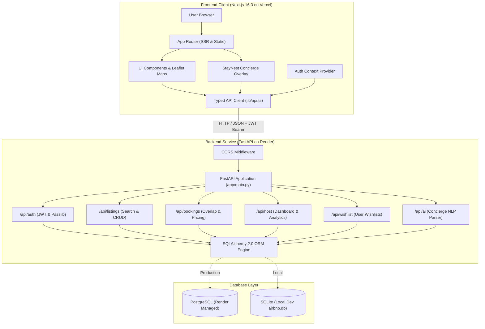
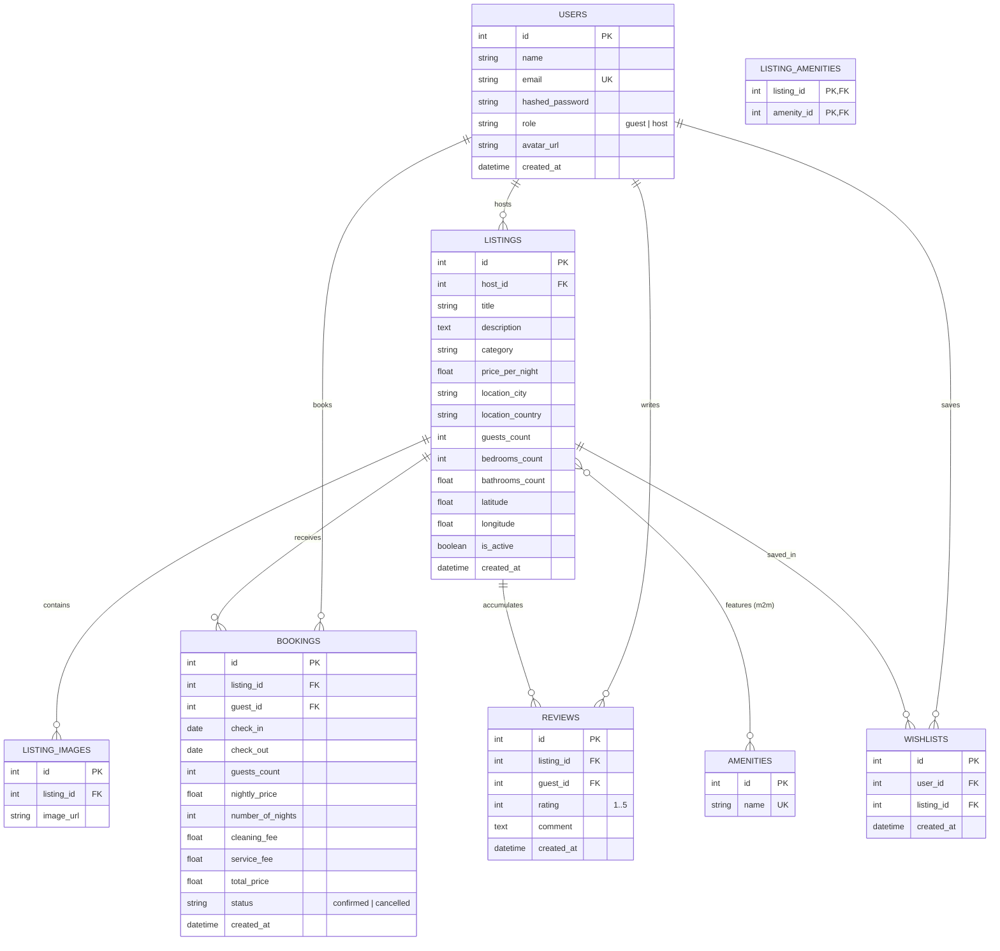

# StayNest

> **A full-stack accommodation discovery, reservation, and property management platform built with Next.js, FastAPI, and PostgreSQL.**

StayNest is an end-to-end travel accommodation platform engineered to connect travelers with distinctive stays worldwide. Built as a high-performance, typed full-stack system, it delivers faceted marketplace exploration, interactive Leaflet mapping, date availability conflict resolution, server-side transactional pricing, mock checkout workflows, persistent traveler wishlists, host management consoles, and an integrated rule-based natural language stay concierge.

---

### Tech Stack


---

## Live Links & Services

| Service | Environment | URL / Endpoint |
|---|---|---|
| **Live Application** | Production (Vercel) | *[Deployment Pipeline Configured]* |
| **Backend API** | Production (Render) | `https://stay-nest-backend-43zk.onrender.com` |
| **Interactive API Docs** | Swagger UI | `https://stay-nest-backend-43zk.onrender.com/docs` |
| **Alternative API Docs** | ReDoc | `https://stay-nest-backend-43zk.onrender.com/redoc` |
| **Source Repository** | GitHub | `https://github.com/pendyala-surya-venkata-sanjay/AIR_BNB-CLONE` |

---

## Project Snapshot

| Dimension | Implementation Details |
|---|---|
| **Frontend Architecture** | Next.js 16.3 App Router, React 19, TypeScript, Tailwind CSS v4 |
| **Backend Architecture** | FastAPI 0.111, Python 3.12, Uvicorn ASGI, Pydantic v2 schemas |
| **Database & ORM** | PostgreSQL (Production on Render) / SQLite (Local dev), SQLAlchemy 2.0 ORM |
| **Authentication** | Stateless JWT (`python-jose`) with salted `bcrypt` password hashing |
| **Map Engine** | Leaflet & React-Leaflet with OpenStreetMap geospatial tiles |
| **Natural Language Concierge** | Deterministic regex & keyword entity extraction engine targeting active DB |
| **Automated Testing** | 19 API integration test suites executed with Pytest & HTTPX TestClient |
| **Deployment** | Frontend on Vercel Edge; Backend on Render Web Service; PostgreSQL on Render |

---

## What StayNest Solves

Booking lodging online is often hindered by inconsistent fee transparency, complex filtering controls, and double-booking concurrency conflicts. StayNest resolves these challenges through a unified engineering architecture:

1. **Deterministic Availability & Overlap Protection**: Validates date intervals server-side within immediate write transactions to mathematically eliminate overlapping bookings for the same property.
2. **Server-Enforced Pricing Computation**: Completely decouples monetary calculations from client inputs; nightly rates, cleaning fees (15%), and platform service fees (10%) are calculated and verified exclusively on the backend.
3. **Multi-Faceted Marketplace Discovery**: Combines full-text location search with price range bounds, guest capacities, structured amenity filters, category classifications, and rating/price sorting.
4. **Intuitive Stay Discovery Assistant**: Translates conversational travel intent into structured database filter parameters via the built-in StayNest Concierge.

---

## Key Features

```text
┌──────────────────────────────────────────────────────────────────────────┐
│                         STAYNEST FEATURE MATRIX                          │
├──────────────────────────────┬───────────────────────────────────────────┤
│ Guest Journey                │ Host Console & Platform                   │
├──────────────────────────────┼───────────────────────────────────────────┤
│ • Full-Text & Keyword Search │ • Host Metrics & Revenue Dashboard        │
│ • Dynamic Attribute Filters  │ • Property Listing Publisher & Editor     │
│ • High-Resolution Galleries  │ • Soft-Deactivation Lifecycle             │
│ • Dynamic Blocked Calendar   │ • Incoming Guest Reservation Feeds        │
│ • Two-Step Checkout Sandbox  │ • Role-Based Access Control (RBAC)        │
│ • "My Journeys" Trip Board   │ • Relational Integrity & Cascades         │
│ • Persistent User Wishlists  │ • Natural Language Stay Concierge Overlay │
│ • Verified Guest Reviews     │ • Responsive Mobile & Desktop Layouts     │
└──────────────────────────────┴───────────────────────────────────────────┘
```

### Guest Experience
* **Discovery & Exploration**: Instant faceted filtering across categories (*Beachfront*, *Cabins*, *Mansions*, *Lofts*, *Townhouses*, *Domes*), price boundaries, guest limits, and amenities (*Wi-Fi*, *Pool*, *Kitchen*, *Free parking*, *Air conditioning*, *Hot tub*, *Gym*, *TV*, *Pet friendly*).
* **Listing Details & Visual Gallery**: Comprehensive stay showcases featuring multi-image carousels, host credentials, amenity inventories, verified guest reviews, and interactive spatial map views.
* **Interactive Availability Calendar**: Custom-built date range selector dynamically rendering blocked/booked dates in real time.
* **Reservation & Checkout Simulation**: Two-step checkout workflow with instant subtotal and tax calculation, mock card verification (card number, expiry, CVV), and unique booking reference generation.
* **My Journeys Dashboard**: Dedicated traveler workspace categorizing bookings into upcoming, completed, and cancelled trips with one-click reservation cancellation.
* **Wishlist Board**: Persistent property bookmarking tied directly to the user's relational database profile.
* **Verified Reviews**: Star ratings (1 to 5) and feedback submission constrained to authenticated guest accounts.

### Host Experience
* **Host Console Dashboard**: Real-time operational overview tracking total active properties, aggregate guest reservations, and estimated platform earnings.
* **Listing Publisher & Editor**: Multi-step property management interface supporting title, description, category, nightly pricing, city, country, capacity, bedroom/bathroom counts, coordinates, amenities, and image links.
* **Listing Lifecycle Management**: Allows hosts to soft-deactivate listings without deleting historical booking records or guest reviews.
* **Reservation Feed**: Chronological list of guest bookings detailing guest profiles, check-in/out dates, and revenue breakdowns.

### Platform & UX Capabilities
* **Stateless JWT Authentication**: Secure login/registration flows supporting dual roles (`guest` vs `host`) with instant demo account quick-fill options.
* **Defensive UI States**: Smooth skeleton loaders for data fetching, informative empty states when no listings match filters, and graceful error alerts with retry triggers.
* **Spatial Mapping**: Client-side lazy-loaded Leaflet maps with custom markers and interactive listing popups.

---

## StayNest Concierge Assistant

The application includes the **StayNest Concierge**, a global floating conversational overlay accessible from any page.

```
┌─────────────────┐
│   User Prompt   │  "Find me a peaceful cabin in Manali under ₹10,000 for 2 guests"
└────────┬────────┘
         │  HTTP POST /api/ai/concierge
         ▼
┌─────────────────┐
│  Regex / Rule   │  • Destination: "Manali"      • Max Price: 10000.0
│  NLP Extractor  │  • Category: "Cabins"         • Guests: 2
└────────┬────────┘  • Preferences: ["peaceful", "cabin"]
         │
         ▼
┌─────────────────┐
│ Database Query  │  SELECT * FROM listings WHERE location_city ILIKE '%Manali%'
│ & Preview Match │  AND price_per_night <= 10000 AND guests_count >= 2 ...
└────────┬────────┘
         │
         ▼
┌─────────────────┐
│ Conversational  │  Inline preview cards with property thumbnails, nightly rates,
│ Response & Link │  and a direct deep-link handoff to /explore pre-filtered
└─────────────────┘
```

### Technical Design
* **Deterministic NLP Processing**: Operates via structured pattern matching, regex tokenization, and numerical range extraction in [`backend/app/routers/ai.py`](backend/app/routers/ai.py).
* **Zero External Dependencies**: Operates entirely self-contained without requiring external LLM API keys or vector databases, ensuring deterministic, sub-10ms response latency.
* **Direct Database Integration**: Evaluates natural language constraints against the actual database inventory and returns real matching stays.

---

## Curated Inventory (28 Verified Stays)

StayNest includes a curated database seed of **28 distinctive properties**:

* **18 International Properties**: Iconic global stays across Malibu, Aspen, Florence, Kyoto, Santorini, Tromsø, Cape Town, Beverly Hills, Ubud, Zermatt, Joshua Tree, Rio de Janeiro, Provence, Sydney, Positano, Phuket, Costa Rica, and Tokyo.
* **10 Curated Indian Stays**:
  * *Srinagar, Jammu & Kashmir* — Premium Dal Lake Heritage Houseboat
  * *Manali, Himachal Pradesh* — Himalayan Cedar Wood Cabin
  * *Jaipur, Rajasthan* — Royal Heritage Haveli Suite
  * *Udaipur, Rajasthan* — Lake Pichola Waterfront Palace Villa
  * *Rishikesh, Uttarakhand* — Ganges Riverview Yoga Sanctuary
  * *Goa* — Tropical Beachside Luxury Villa
  * *Hyderabad, Telangana* — Financial District Skyline Penthouse
  * *Kochi, Kerala* — Fort Kochi Dutch Colonial Haveli
  * *Ooty, Tamil Nadu* — Nilgiri Mist Mountain Cottage
  * *Alleppey, Kerala* — Backwaters Waterfront Lagoon Villa

---

## System Architecture



### Architectural Layering

1. **Presentation Layer (Next.js App Router)**: Component-driven architecture utilizing React 19 hooks, client/server boundaries, Tailwind CSS v4 styling, and dynamic imports for Leaflet maps to eliminate SSR hydration mismatches.
2. **API Client Layer (`frontend/src/lib/api.ts`)**: Centralized typed HTTP fetch wrapper handling environment-based base URL resolution, bearer token injection, and standardized error parsing.
3. **Application & Routing Layer (FastAPI)**: Modular router organization with strict Pydantic v2 schemas for request validation, role-based dependency injection (`get_current_user`, `get_current_guest`, `get_current_host`), and CORS origin controls.
4. **Domain & Business Logic Layer**: Server-enforced validation for booking date constraints, capacity limits, overlap detection, host self-booking prohibitions, and idempotent database seeding.
5. **Persistence Layer (SQLAlchemy ORM)**: Relational schema mapping with foreign key cascades, unique constraints, and eager-loading optimizations (`joinedload`, `selectinload`) to eliminate N+1 query overhead.

---

## Technical Booking Flow

```text
[ Guest ]                   [ Frontend ]                  [ FastAPI Backend ]              [ Database ]
    │                            │                                 │                             │
    │ 1. Select Dates & Guests   │                                 │                             │
    │───────────────────────────>│                                 │                             │
    │                            │ 2. POST /api/bookings           │                             │
    │                            │────────────────────────────────>│                             │
    │                            │                                 │ 3. Check Listing Active     │
    │                            │                                 │────────────────────────────>│
    │                            │                                 │                             │
    │                            │                                 │ 4. Verify Not Host Own Stay │
    │                            │                                 │    Check-In < Check-Out     │
    │                            │                                 │    Check-In >= Today        │
    │                            │                                 │    Guests <= Max Capacity   │
    │                            │                                 │                             │
    │                            │                                 │ 5. Overlap Query            │
    │                            │                                 │    (status != 'cancelled')  │
    │                            │                                 │────────────────────────────>│
    │                            │                                 │                             │
    │                            │                                 │ 6. Server Price Calculation │
    │                            │                                 │    Subtotal + Fees (25%)    │
    │                            │                                 │                             │
    │                            │                                 │ 7. Insert Booking Record    │
    │                            │                                 │────────────────────────────>│
    │                            │ 8. HTTP 201 Created (Booking)   │                             │
    │                            │<────────────────────────────────│                             │
    │ 9. Redirect to Checkout    │                                 │                             │
    │<───────────────────────────│                                 │                             │
    │                            │                                 │                             │
    │ 10. Enter Sandbox Payment  │                                 │                             │
    │───────────────────────────>│                                 │                             │
    │                            │ 11. Booking Confirmed           │                             │
    │ 12. Display Confirmation   │                                 │                             │
    │<───────────────────────────│                                 │                             │
```

---

## Database Schema & Entity Relationships



---

## API Reference

All backend endpoints are prefixed with `/api` and return typed JSON responses.

### 1. Authentication (`/api/auth`)
* `POST /api/auth/register` — Register a new account (`guest` or `host` role).
* `POST /api/auth/login` — Authenticate with email/password and receive a JWT Bearer token.
* `GET /api/auth/me` — Retrieve the authenticated user's profile (`Bearer <token>` required).

### 2. Listings (`/api/listings`)
* `GET /api/listings/` — Search and filter active listings (supports `location`, `category`, `min_price`, `max_price`, `guests`, `check_in`, `check_out`, `amenities`, `sort_by`, `page`, `limit`).
* `GET /api/listings/{id}` — Fetch detailed listing record including images, amenities, host, and reviews.
* `GET /api/listings/{id}/availability` — Retrieve active booked date ranges to block on calendars.
* `POST /api/listings/` — Create a new accommodation listing (`host` role required).
* `PUT /api/listings/{id}` — Update an existing listing (must be listing owner).
* `DELETE /api/listings/{id}` — Soft-deactivate a listing (preserves historical bookings).

### 3. Bookings (`/api/bookings`)
* `POST /api/bookings/` — Create a new stay booking with server-side validation (`guest` role required).
* `GET /api/bookings/my-trips` — Fetch all bookings for the authenticated user.
* `GET /api/bookings/{id}` — Retrieve specific booking details (authorized for guest or listing host).
* `POST /api/bookings/{id}/cancel` — Cancel an active booking.

### 4. Host Management (`/api/host`)
* `GET /api/host/listings` — List all properties owned by the current host.
* `GET /api/host/bookings` — Fetch all guest reservations booked across host-owned properties.

### 5. Wishlist (`/api/wishlist`)
* `GET /api/wishlist/` — Retrieve the authenticated user's bookmarked listings.
* `POST /api/wishlist/{listing_id}` — Add a listing to the personal wishlist.
* `DELETE /api/wishlist/{listing_id}` — Remove a listing from the personal wishlist.

### 6. Reviews (`/api/listings/{id}/reviews`)
* `GET /api/listings/{id}/reviews` — Retrieve public reviews for a listing.
* `POST /api/listings/{id}/reviews` — Post a star rating and comment (`guest` role required).

### 7. Concierge (`/api/ai`)
* `POST /api/ai/concierge` — Parse natural language stay requests into structured search criteria.

---

## Repository Structure

```text
StayNest/
├── backend/
│   ├── app/
│   │   ├── auth.py              # JWT encoding/decoding & bcrypt hashing helpers
│   │   ├── database.py          # Database engine, session factories & URL normalizer
│   │   ├── main.py              # FastAPI app setup, CORS & router aggregation
│   │   ├── models.py            # SQLAlchemy relational models & database constraints
│   │   ├── schemas.py           # Pydantic request/response models & validation
│   │   ├── seed.py              # Idempotent database seeder (28 properties + users)
│   │   └── routers/
│   │       ├── ai.py            # Natural language Concierge parser endpoint
│   │       ├── auth.py          # Authentication routes (register, login, profile)
│   │       ├── bookings.py      # Booking creation, overlap checks, and cancellations
│   │       ├── host.py          # Host property catalogs and reservation feeds
│   │       ├── listings.py      # Paginated search, filters, and listing CRUD
│   │       └── wishlist.py      # User wishlist management endpoints
│   ├── tests/
│   │   └── test_api.py          # Pytest suite with 19 API integration test cases
│   ├── requirements.txt         # Pinned backend Python dependencies
│   └── airbnb.db                # Local development SQLite database
│
├── frontend/
│   ├── src/
│   │   ├── app/
│   │   │   ├── layout.tsx       # Root HTML layout, navbar, footer & Concierge overlay
│   │   │   ├── page.tsx         # Landing page with hero search & India slideshow
│   │   │   ├── explore/         # Marketplace catalog with search & multi-filter drawer
│   │   │   ├── listings/[id]/   # Property detail view, photo gallery & booking card
│   │   │   ├── checkout/[id]/   # Reservation confirmation & payment simulation
│   │   │   ├── trips/           # Guest trip history & reservation management
│   │   │   ├── wishlist/        # Saved properties board
│   │   │   ├── host/            # Host console, listing creator & editor pages
│   │   │   ├── login/           # User login portal with demo account auto-fill
│   │   │   └── register/        # Account registration with role selection
│   │   ├── components/          # Reusable UI widgets (Navbar, Modals, Maps, Cards)
│   │   ├── context/             # Authentication and Toast React contexts
│   │   ├── lib/                 # Typed API client wrapper (api.ts)
│   │   └── types/               # TypeScript interface definitions (index.ts)
│   ├── package.json             # Pinned frontend npm dependencies
│   ├── next.config.ts           # Next.js compiler configuration
│   └── tsconfig.json            # TypeScript configuration
│
├── .env.example                 # Environment variable templates with safe defaults
├── .gitignore                   # Comprehensive exclusions for build artifacts & secrets
├── pytest.ini                   # Pytest test execution settings
└── README.md                    # System documentation
```

---

## Local Development Setup

### Prerequisites
* **Python**: `3.12+`
* **Node.js**: `18.x` or `20.x` with `npm`
* **Git**

### 1. Clone Repository
```bash
git clone https://github.com/pendyala-surya-venkata-sanjay/AIR_BNB-CLONE.git
cd AIR_BNB-CLONE
```

### 2. Backend Setup
```bash
cd backend

# Create and activate Python virtual environment
python -m venv venv
# Windows (PowerShell):
.\venv\Scripts\activate
# macOS/Linux:
source venv/bin/activate

# Install dependencies
pip install -r requirements.txt

# Run idempotent seed script to populate local SQLite database
python -m app.seed

# Start FastAPI development server
uvicorn app.main:app --reload --host 127.0.0.1 --port 8000
```
* Backend API: `http://localhost:8000`
* Swagger Documentation: `http://localhost:8000/docs`

### 3. Frontend Setup
```bash
# Open a new terminal from project root
cd frontend

# Install npm dependencies
npm install

# Start Next.js development server
npm run dev
```
* Frontend Application: `http://localhost:3000`

---

## Environment Variables

### Backend Configuration (`backend/.env`)
```env
# Database URI: SQLite locally or PostgreSQL in production
DATABASE_URL=sqlite:///./airbnb.db

# Secret key used for signing JWT tokens (Enforced in production)
JWT_SECRET=your_super_secret_jwt_key_here

# Frontend URL allowed by CORS middleware
FRONTEND_URL=http://localhost:3000
```

### Frontend Configuration (`frontend/.env.local`)
```env
# Public backend API URL targeted by browser and SSR fetches
NEXT_PUBLIC_API_URL=http://localhost:8000
```

---

## Database Seeding & Idempotency

The database seeding mechanism in [`backend/app/seed.py`](backend/app/seed.py) is engineered to be **safe, non-destructive, and idempotent**:

* **No Table Deletions**: Tables are created using `Base.metadata.create_all()`; destructive `drop_all` statements are not used.
* **Pre-Insertion Verification**: Users are verified by `email`, amenities by `name`, listings by `title`, bookings by `(listing_id, guest_id, check_in, check_out)`, reviews by `(listing_id, guest_id, comment)`, and wishlists by `(user_id, listing_id)`.
* **Multi-Run Safety**: The script can be executed repeatedly on fresh or populated databases without throwing unique constraint violations or creating duplicate records.

---

## Automated Testing

The backend test suite is located in [`backend/tests/test_api.py`](backend/tests/test_api.py) and runs against an isolated in-memory SQLite database.

```bash
# Run backend integration tests from project root
python -m pytest backend/tests/test_api.py
```

### Verified Test Results
```text
============================= test session starts =============================
platform win32 -- Python 3.12.7, pytest-8.2.2, pluggy-1.6.0
collected 19 items

backend\tests\test_api.py ...................                            [100%]

============================= 19 passed in 8.66s ==============================
```

### Areas Covered by Tests
1. **User Authentication**: Registration, duplicate email rejection, login success, invalid credentials rejection, and `/me` profile retrieval.
2. **Listings Exploration**: Paginated retrieval, multi-attribute filtering, and single listing retrieval.
3. **Listing Management**: Host listing creation and guest unauthorized listing creation prevention.
4. **Booking Validation**: Successful reservation creation, overlapping booking rejection, host self-booking prevention, and booking cancellations.
5. **Wishlists & Reviews**: User wishlist toggle operations and guest review submissions.
6. **Concierge NLP**: Basic prompt parsing, complex multi-filter extraction, and character limit validations.

---

## Security Controls

* **Password Security**: Passwords salted and hashed with `bcrypt` via `passlib`; plain text credentials are never persisted.
* **Stateless Tokens**: Signed HMAC-SHA256 JWT tokens with role payload verification.
* **Role-Based Access Control**: Strict endpoint dependencies (`get_current_guest`, `get_current_host`) protecting sensitive host and guest operations.
* **IDOR & Ownership Protection**: Explicit verification ensures guests and hosts can only inspect or cancel their own bookings and listings.
* **Transaction Safety**: Server-side price calculation and concurrency-safe availability validation prevent client-side price tampering.
* **CORS Restrictions**: Origin whitelisting via `CORSMiddleware` restricted to configured `FRONTEND_URL`.
* **Repository Hygiene**: Strict [`.gitignore`](.gitignore) rules ensuring `.env`, `.env.local`, SQLite databases, and `.next` build outputs are excluded from version control.

---

## Performance & Optimization

* **Eager Loading Optimization**: Listing queries use SQLAlchemy `joinedload` and `selectinload` for host relations, images, amenities, and reviews, eliminating N+1 database queries.
* **Dynamic Client-Side Maps**: Leaflet mapping components are loaded dynamically on the client side to minimize initial JavaScript bundle size and prevent SSR hydration errors.
* **Dual-Environment API Routing**: The API client intelligently targets server-side internal addresses during SSR and public URLs during client-side execution.
* **Responsive Visual Feedback**: Instant skeleton screens and spinners provide fluid feedback across mobile and desktop devices.

---

## Production Deployment Architecture

```text
┌─────────────────────────────────────────────────────────────┐
│                   PRODUCTION DEPLOYMENT                     │
├──────────────────────────────┬──────────────────────────────┤
│ Service Layer                │ Deployment Target            │
├──────────────────────────────┼──────────────────────────────┤
│ Frontend Web Application     │ Vercel Edge Network          │
│ Backend API Service          │ Render Web Service           │
│ Relational Database          │ Render Managed PostgreSQL    │
└──────────────────────────────┴──────────────────────────────┘
```

### Backend (Render)
* **Build Command**: `pip install -r backend/requirements.txt`
* **Start Command**: `python -m uvicorn app.main:app --host 0.0.0.0 --port $PORT`
* **Environment Variables**:
  * `DATABASE_URL`: Production PostgreSQL connection string.
  * `JWT_SECRET`: High-entropy secret token.
  * `FRONTEND_URL`: `https://<your-vercel-domain>.vercel.app`

### Frontend (Vercel)
* **Framework Preset**: Next.js (Root Directory: `frontend`)
* **Environment Variables**:
  * `NEXT_PUBLIC_API_URL`: `https://stay-nest-backend-43zk.onrender.com`

### Production Seeding
The idempotent seed script can be executed securely from a trusted local environment using the production `DATABASE_URL`, without committing secrets:
```bash
# Windows (PowerShell):
$env:DATABASE_URL="<production_postgresql_external_url>"
python backend/app/seed.py

# macOS / Linux (Bash):
DATABASE_URL="<production_postgresql_external_url>" python -m backend.app.seed
```

---

## Engineering Highlights

1. **Transactional Date Conflict Validation**: Availability checking verifies active reservations within database transactions to prevent double-booking anomalies.
2. **Server-Side Fee Integrity**: Nightly prices, cleaning fees (15%), and service fees (10%) are strictly calculated server-side, protecting platform revenue against client manipulation.
3. **Idempotent Multi-Dialect Seeding**: Seeding logic seamlessly supports both SQLite (local development) and PostgreSQL (production) with zero schema drift.
4. **Deterministic Natural Language Parser**: Fast regex/rule-based NLP extraction resolves user intent in under 10ms with zero reliance on costly external LLM APIs.
5. **Clean Separation of Concerns**: Clear boundary between Next.js presentation state, FastAPI REST endpoints, and SQLAlchemy persistence models.

---

## Architecture Quick View (How StayNest Works)

* **Browsing**: The browser loads pre-rendered Next.js pages, which fetch paginated listings from FastAPI using eager-loaded SQLAlchemy queries.
* **Filtering**: User queries (price, amenities, location, dates) are translated into SQL filter clauses on the backend with indexed lookups.
* **Concierge**: User prompts sent to `/api/ai/concierge` are parsed into structured filters and matched against the live database inventory.
* **Booking**: Check-in/out dates are verified against active reservations, fees are calculated server-side, and a confirmed booking is created.
* **Checkout**: The guest completes a simulated transaction, generating an immutable booking record visible in **My Journeys**.
* **Host Control**: Hosts manage listings, track guest reservations, and review aggregate earnings from the dedicated Host Console.

---

## Future Roadmap

* **Live Payment Gateway**: Integration with Stripe / Razorpay for real payment card authorization and automated host payouts.
* **Cloud Asset Storage**: Direct integration with AWS S3 / Cloudinary for user-uploaded property photography.
* **Multi-Turn LLM Agent**: Optional expansion of the StayNest Concierge into an agentic multi-turn conversational planner.
* **Instant In-App Messaging**: Real-time WebSocket chat between guests and property hosts.

---

## License & Authorship

* **Author**: Sanjay Pendyala
* **Repository**: [AIR_BNB-CLONE](https://github.com/pendyala-surya-venkata-sanjay/AIR_BNB-CLONE)
* **License**: Open-source for academic, demonstration, learning, and portfolio purposes.

